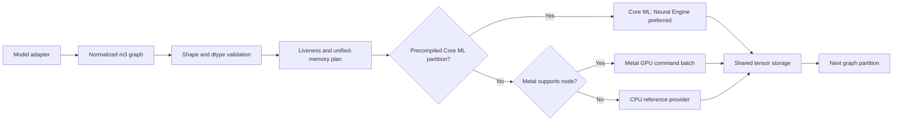
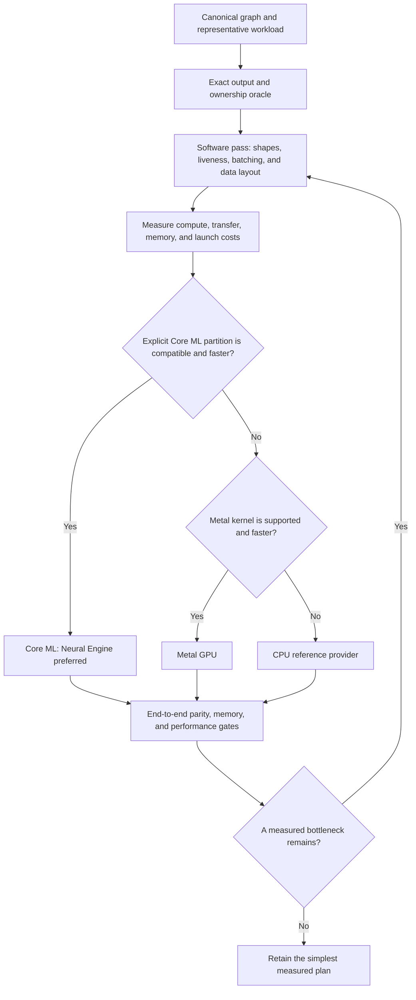

# m3.c

`m3.c` is a native C11 inference runtime for macOS. Its model-neutral graph API
owns tensor metadata, validates topological data flow, infers output shapes,
reuses unified-memory storage by liveness, and schedules one graph across Apple
Neural Engine, Metal GPU, and CPU providers in that preference order.

Music3 is the first complete model adapter. It runs the official
[MiniMaxAI/MiniMax-Music3](https://huggingface.co/MiniMaxAI/MiniMax-Music3)
caption-and-lyrics-to-stereo-waveform pipeline without Python, PyTorch, or
Diffusers. The adapter and the public graph API share the same tensor,
operation, storage, and provider scheduler; there is no second model runtime.

## Status

Current version: `0.1.0`

Verified on an Apple M4 Mac with 32 GiB unified memory:

- Strict suite: 178 cases, 2,781 checks, 0 skipped.
- ASan and UBSan suite: 178 cases, 2,781 checks, 0 skipped.
- Core ML to Metal heterogeneous graph: passed with shared tensor storage.
- CPU-only graph and liveness planner: passed.
- Official pinned-weight Metal E2E: passed every generation phase.
- E2E smoke request: one generated frame, 1,536 samples per channel.
- Official model revision:
  `bd348f9c49ea3c1b39f33ace3436f8fad435f24e`.

The runtime implements:

- Official model-directory, config, tensor-name, dtype, rank, and shape checks.
- Music3 prompt normalization and tokenizer loading.
- Qwen semantic generation with classifier-free guidance.
- Seven-book RVQ depth decoding and complete-frame Qwen feedback.
- Condition encoding and the 36-layer flow-matching transformer.
- Thirty-step Euler flow synthesis with official chunk overlap behavior.
- Weight-normalized stereo vocoder decoding.
- Exact post-decode crop, planar assembly, clamping, and WAVE interleaving.
- Transactional outputs, deterministic RNG state, progress, and cancellation.

The official Music3 snapshot contains Safetensors, not compiled Core ML
partitions, so its current neural path selects Metal. A model adapter can add
precompiled `.mlmodelc` partitions to the same graph; those partitions load
with Core ML `CPUAndNeuralEngine`, regular supported nodes select Metal, and
remaining regular nodes select CPU. Core ML makes the final per-operation ANE
placement decision and may use CPU for operations the Neural Engine cannot
run.

## Runtime architecture

The graph is supplied in topological order. Inputs, constants, temporaries,
and outputs have explicit dtypes and ranks; `m3_graph_add_inferred_value`
derives output shapes for regular operations. Session compilation rejects
read-before-produce and multiple-producer graphs, validates every lowered
operation, performs interval liveness analysis, and allocates reusable storage
slots before execution.



Core ML partitions are explicit packaged subgraphs rather than an automatic
second translation of every operator. That keeps one graph, one ownership
plan, and one scheduler while allowing adapters with compiled Apple Neural
Engine assets to use them directly.

## Requirements

- macOS. Metal execution requires a Metal-capable GPU; Neural Engine execution
  requires a supported Apple-silicon Mac and a compatible Core ML partition.
- Apple Clang with C11 and Objective-C ARC support.
- GNU Make.
- Enough local storage for the selected official model snapshot.
- Substantial unified memory or swap for the official Music3 adapter.

The full official pipeline was verified on a 32 GiB M4. Smaller-memory systems
may fail the runtime's allocation preflight or experience heavy swap use.

## Build and test

Build the static library:

```sh
make -j8
```

Run the strict real-Metal test suite:

```sh
make test -j8
```

Run the AddressSanitizer and UndefinedBehaviorSanitizer suite:

```sh
make test-sanitize -j8
```

Remove generated build products:

```sh
make clean
```

## General graph API

The public graph/session API is declared in `include/m3.h`. This minimal graph
multiplies two F32 vectors. The constant and graph can be released after the
session is compiled because the session owns its plan and constant copy.

```c
#include "m3.h"

int main(void)
{
    const uint64_t shape[] = {4};
    const float scale[] = {2, 2, 2, 2};
    const float input[] = {1, 2, 3, 4};
    float output[4];
    m3_graph_value_desc value;
    m3_graph_node_desc node;
    m3_graph_value_id x, c, y;
    m3_graph *graph = NULL;
    m3_session *session = NULL;
    m3_error error;

    m3_graph_create(&graph, &error);
    m3_graph_value_desc_init(
        &value, M3_GRAPH_INPUT, M3_DTYPE_F32, 1, shape);
    m3_graph_add_value(graph, &value, &x, &error);
    value.role = M3_GRAPH_CONSTANT;
    m3_graph_add_value(graph, &value, &c, &error);
    m3_graph_set_constant(graph, c, scale, sizeof(scale), &error);

    m3_graph_node_desc_init(&node, M3_OP_MUL);
    node.inputs[0] = x;
    node.inputs[1] = c;
    m3_graph_add_inferred_value(
        graph, &node, 0, M3_GRAPH_OUTPUT, M3_DTYPE_F32, &y, &error);
    node.outputs[0] = y;
    m3_graph_add_node(graph, &node, &error);

    m3_session_create(&session, graph, NULL, &error);
    m3_graph_free(graph);
    m3_session_write_input(session, x, input, sizeof(input), &error);
    m3_session_run(session, &error);
    m3_session_read_output(session, y, output, sizeof(output), &error);
    m3_session_free(session);
    return 0;
}
```

The default session enables Neural Engine, Metal, and CPU. Disable providers
with `m3_session_options` when a deployment needs a strict subset. A Core ML
node binds named graph values to a `.mlmodel`, `.mlpackage`, or compiled
`.mlmodelc` through `m3_graph_add_coreml_partition`. F32, F16, and I32 Core ML
multi-arrays are supported; BF16 stays on the regular Metal/CPU path.

Regular-node input and output positions are fixed:

| Operations | Inputs | Outputs |
| --- | --- | --- |
| COPY, CAST, SOFTMAX, NEAREST_RESIZE1D, TANH | input | output |
| ADD, MUL, MATMUL, GATED_SILU | left, right | output |
| EMBEDDING | IDs, table | output |
| LINEAR | input, weight, optional bias | output |
| RMS_NORM | input, scale | output |
| LAYER_NORM | input, scale, optional bias | output |
| ROPE | input, cosines, sines | output |
| ATTENTION | query, key, value, optional mask | output |
| TOP_K | logits | F32 values, I32 indices |
| CATEGORICAL | probabilities, uniforms | I32 output |
| CONV1D, CONV_TRANSPOSE1D | input, weight, optional bias | output |
| SNAKE1D | input, alpha | output |

Unused and optional positions are `M3_GRAPH_VALUE_NONE`. Operator parameters
such as epsilon, attention scale, top-k `k`, convolution geometry, and resize
length live in `m3_graph_node_desc.parameters`.

The Apple arm64 driver does not accept standalone `-fsanitize=leak`, but its
ASan runtime supports integrated leak checking. Run the same sanitizer suite
with the leak detector explicitly enabled when that additional gate is needed:

```sh
ASAN_OPTIONS='detect_leaks=1:leak_check_at_exit=1' make test-sanitize -j8
```

The tests also assert backend allocation baselines on ownership-sensitive
paths; LeakSanitizer covers CPU heap ownership, not Metal driver resources.

## Official model weights

Model binaries are local runtime data and are intentionally excluded from Git.
Use this repository-local layout:

```text
models/
└── MiniMax-Music3-bd348/
    ├── modular_model_index.json
    ├── scheduler/
    ├── tokenizer/
    ├── language_model/
    │   ├── model-00001-of-00004.safetensors
    │   ├── model-00002-of-00004.safetensors
    │   ├── model-00003-of-00004.safetensors
    │   └── model-00004-of-00004.safetensors
    ├── rvq_depth_decoder/
    │   └── diffusion_pytorch_model.safetensors
    ├── condition_encoder/
    │   └── diffusion_pytorch_model.safetensors
    ├── transformer/
    │   ├── diffusion_pytorch_model-00001-of-00002.safetensors
    │   └── diffusion_pytorch_model-00002-of-00002.safetensors
    └── vocoder/
        └── diffusion_pytorch_model.safetensors
```

Install the current Hugging Face CLI, then download the exact engine-required
snapshot:

```sh
hf download MiniMaxAI/MiniMax-Music3 \
  --revision bd348f9c49ea3c1b39f33ace3436f8fad435f24e \
  --local-dir models/MiniMax-Music3-bd348 \
  --include modular_model_index.json \
  --include 'scheduler/*' \
  --include 'tokenizer/*' \
  --include 'language_model/*' \
  --include 'rvq_depth_decoder/*' \
  --include 'condition_encoder/*' \
  --include 'transformer/*' \
  --include 'vocoder/*'
```

This is 22 engine-consumed files and approximately 27 GiB on disk, including
nine weight files. Verify the pinned files before opening the model root:

```sh
uvx --from huggingface_hub hf cache verify \
  MiniMaxAI/MiniMax-Music3 \
  --revision bd348f9c49ea3c1b39f33ace3436f8fad435f24e \
  --local-dir models/MiniMax-Music3-bd348
```

The filtered snapshot intentionally omits 66 unrelated remote files, so the
verifier warns that they are missing. A successful required-file verification
reports `checked=22` with no checksum mismatch; local `.cache/huggingface`
metadata and lock files may also be reported as remote-repository extras.

The Hub repository also contains an older/reference packaging family,
including `qwen_7B/`, `flowmatching_vae.pth`, and `dav.pth`, plus scripts and
assets. A complete archival mirror is 88 files and about 57.4 GB:

```sh
hf download MiniMaxAI/MiniMax-Music3 \
  --revision bd348f9c49ea3c1b39f33ace3436f8fad435f24e \
  --local-dir models/MiniMax-Music3-bd348-full
```

Those alternate artifacts are not inputs to this runtime. The largest single
checkpoint is not a complete Music3 pipeline: semantic, RVQ, condition, flow,
and vocoder weights are independent required components.

`m3_music3_engine_open` validates the official structure and tensor contracts,
but the model root is caller-trusted. It does not authenticate the Hub revision
or hash file contents, so use the checksum verification command above.

## Minimal generation example

```c
#include "m3.h"

#include <stdio.h>

int main(void)
{
    static const char caption[] = "Warm electronic instrumental music.";
    static const char lyrics[] = "[verse]\nHello world.";
    m3_music3_engine *engine = NULL;
    m3_music3_output *output = NULL;
    m3_music3_request request = {
        {caption, sizeof(caption) - 1U},
        {lyrics, sizeof(lyrics) - 1U},
        1U,
        20260815U,
        0U,
    };
    m3_error error;
    m3_status status;

    m3_error_reset(&error);
    status = m3_music3_engine_open(
        &engine, "models/MiniMax-Music3-bd348", &error);
    if (status == M3_STATUS_OK) {
        status = m3_music3_generate(
            engine, &request, NULL, NULL, &output, &error);
    }
    if (status == M3_STATUS_OK) {
        status = m3_music3_output_write_wav(
            output, "music3.wav", &error);
    }
    if (status != M3_STATUS_OK) {
        (void)fprintf(stderr, "%s\n", m3_error_message(&error));
    }

    m3_music3_output_free(output);
    m3_music3_engine_free(engine);
    return status == M3_STATUS_OK ? 0 : 1;
}
```

After `make`, compile the example against the static library:

```sh
clang -std=c11 -O3 -Iinclude example.c build/libm3.a -lm \
  -framework Foundation \
  -framework CoreML \
  -framework Metal \
  -framework MetalPerformanceShaders \
  -framework MetalPerformanceShadersGraph \
  -framework Accelerate \
  -o example
```

`maximum_frames` must be between 1 and 9,000. A value of 1 is suitable only
for a smoke test. Generation is synchronous, the engine is non-reentrant and
not thread-safe, and every output must be freed before its owning engine.

## Official-model benchmark and diagnostics

Build the public-API benchmark harness:

```sh
make benchmark -j8
```

The repository includes a macOS monitor that records phase timing, CPU and GPU
utilization, memory pressure, swap, and process RSS. It cancels gracefully if a
configured safety limit is reached and never retries a stochastic generation:

```sh
uv run tools/music3_debug.py
```

Defaults use `models/MiniMax-Music3-bd348`, one maximum frame, seed `20260815`,
and sequence `0`. The full log is written to
`/private/tmp/m3_music3_debug.log`; a successful run retains the validated WAVE
at `/private/tmp/m3_music3_debug.wav`. Use `--delete-wave` to remove it after
the run. Inspect the machine without loading the model with:

```sh
uv run tools/music3_debug.py --sample-only
```

Every threshold, prompt, output path, seed, sequence, and frame cap is exposed
through `--help`; `--quiet` writes only the log. The C harness uses only the
public `include/m3.h` API and
validates phase monotonicity, both complete planar channels, finite/clamped
samples, exact WAVE metadata and interleaving, and deterministic output hashes.

## Measured performance

The current software optimization pass was measured on the same fanless M4
MacBook with 32 GiB unified memory, placed on an MxSW2-hi Cooling Stand, using
the exact pinned weights, a one-frame request, seed `20260815`, and sequence
`0`. The stand is part of the recorded benchmark environment, not a runtime
requirement. Each retained change preserved the two output hashes bit-for-bit.

| Revision | Total | Semantic | Flow | Decode |
| --- | ---: | ---: | ---: | ---: |
| Before this pass (`0c367e7`) | 169.40 s | 37.17 s | 63.84 s | 55.26 s |
| Current | 65.57 s | 17.78 s | 32.83 s | 1.30 s |

That is a 2.58x end-to-end speedup, or 61.3% lower wall time. The retained
changes remove repeated convolution/dense/attention address work, tile dense
kernels, share attention probabilities across output channels, and reduce
flow command-buffer submissions. Larger dense blocks, a small-row tile variant,
Qwen-wide command batching, and typed common loads were measured and rejected
because they were slower on this workload.

A fresh post-integration run through `tools/music3_debug.py` completed in
66.60 seconds with the same two hashes; the 1.6% difference from the table is
normal run-to-run variation on the fanless machine.

The runtime accepts F16 and BF16 tensors for supported operators, but the
official pinned Music3 snapshot is F32 and its schema loader intentionally
requires those exact official dtypes. Running a separately converted FP16
checkpoint would require one deliberate model-schema/numerical-contract change;
it is not silently accepted as the official model.

## Hardware optimization DAG

Hardware placement follows correctness and measurement. Neural Engine is the
first scheduling preference only for explicit Core ML partitions; regular
operators then select Metal when supported and CPU otherwise. Core ML retains
the final choice between Neural Engine and CPU for a partition.



Future provider work should therefore begin with model-owned Core ML
partitions and measured transfer boundaries, then continue with Metal kernel
tuning. CPU staging or execution parallelism is added only when profiling
shows CPU work dominates; dependent model layers remain ordered.

## Public API

The complete public surface is declared in [`include/m3.h`](include/m3.h) and
has two layers:

- The model-neutral graph/session layer creates graph values and regular or
  Core ML nodes, compiles a provider and liveness plan, writes inputs, runs the
  session, reads outputs, and exposes the selected provider per node.
- The Music3 adapter opens the exact official model, generates waveform
  outputs, reads planar channels, and writes stereo WAVE files.

Generation progress is reported as monotonic phase-local counters covering
preparation, semantic weights, semantic decoding, flow weights, flow solving,
vocoder weights, materialization, decoding, and assembly. Returning `false`
from the callback cancels generation without replacing the caller's prior
output.

## License

`m3.c` is licensed under GPL-2.0-only. See [`COPYING`](COPYING). Bundled
Unicode data is covered by [`LICENSES/Unicode-3.0.txt`](LICENSES/Unicode-3.0.txt).
